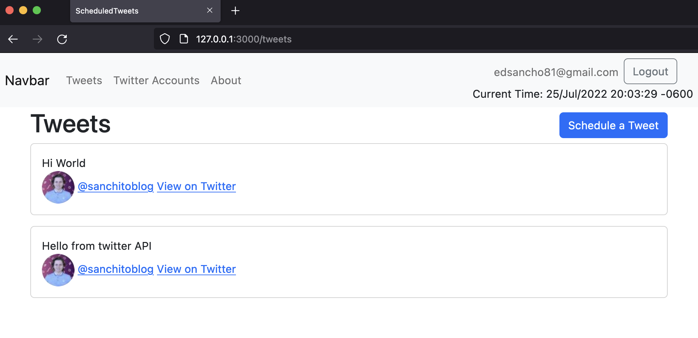

# Scheduled Tweets

## [Live Demo](https://infinite-stream-75498.herokuapp.com/)

## Preview

## Table of Contents

- [Description](#description)
- [Built With](#built-with)
- [Getting Started](#getting-started)
  - [Clone Repo](#clone-repo)
  - [Prerequisites](#prerequisites)
  - [Install Rails](#install-rails)
- [Setup](#setup)
  - [System Dependencies](#system-dependencies)
  - [Database Initialization](#database-initialization)
- [Usage](#usage)
  - [Start Server](#start-server)
  - [Testing RSpec](#testing-rspec)
- [How To Contribute?](#how-to-contribute)
- [Collaborators](#collaborators)
- [Show Your Support](#how-your-support)
- [Acknowledgments](#acknowledgments)
- [License](#license)

## Description
> If you get a clever idea at 2am but you don't want to tweet it just yet (maybe you don't want people to know you were up late at night), then this app is for you.

## Built With

- Major languages: Ruby, Bootstrap.
- Frameworks: Ruby on Rails.
- Tools & Methods: PostgreSQL, Sidekiq, Omniauth.

## Getting Started

We'll need to prepare your computer to handle Ruby on Rails, which might be a hassle, so take a deep breath and cope with me :)

If you have Rails 7 installed, you can skip to the [Setup](#setup) section

## Clone Repo

First clone this repo by running this command in your terminal:
~~~ bash
git clone https://github.com/eduardosancho/scheduled_tweets.git
# wait a couple seconds for it to download
# ...
# ...
# then move into the new directory
cd scheduled_tweets
~~~

## Prerequisites

The following technologies must be installed before hand in your local machine:

 - Ruby (ruby --version). Should be 3.0.1 or newer.
 - SQLite3 (sqlite3 --version)
 - Node.js (node --version)
 - Yarn (yarn --version)  

The commands in parenthesis `()` can be used to verify if they are installed and their corresponding versions.

Refer to [Section 3](https://guides.rubyonrails.org/v5.1/getting_started.html#:~:text=3%20Creating%20a%20New%20Rails%20Project) from the official [Rails Guide](https://rubyonrails.org/) for more detailed instructions on how to install these technologies.

### Install Rails
Once that's done, we can install Rails. For that, run these commands in your terminal:
~~~ bash
gem install rails
# wait a few seconds for it to download
# ...
# ...
# verify that it was installed by running
rails --version
~~~

## Setup

We're getting there... trust me ;)

## System Dependencies

Execute this command to automatically install all the dependencies needed to view and work on this project:

~~~ bash
bundle install
~~~

The full list of dependencies can be found within the [Gemfile](Gemfile).

This also installs PostgreSQL, which you'll need for the next step.

## Database Initialization
To initialize the database we just created, now run:
~~~ bash
rails db:setup
~~~

## Usage
If you got to this point, congratulations! You now have spent 2 hours in order to toy with my app. I appreciate your effort :P

## Start Server
The following command should start a server
~~~ bash
rails server
~~~
Which you can view by going to http://localhost:3000 in your browser.

## Testing RSpec
Tests pending...

## How To Contribute?

Always remember to commit your contributions on a different branch. You can create a new one by running `git checkout -b <branchname>`.

Visit [linters folder](.github/workflows/linters.yml) to learn how to setup linters.

Then check linters locally before pushing by running:
~~~ bash
rubocop --color -A
~~~

Finally, once your changes have no linter errors and all [tests](#testing-rails) are passing, try to merge your branch into  `development` by running:
~~~ bash
git checkout development
git merge <branchname>
~~~
Continue by solving any merge conflicts that may arise, test the functionality of the app once more, and you're changes are ready to be pushed with `git push origin <branchname>`

# That's all folks!

## Collaborators
👤 **Eduardo**

 Platform | Badge |
 --- | --- |
 **GitHub**  | [@eduardosancho](https://github.com/eduardosancho)
 **Twitter** | [@sanchitobless](https://twitter.com/sanchitobless)
 **LinkedIn** | [Eduardo Sancho Solano](https://www.linkedin.com/in/eduardo-sancho-solano/)

 
## Show your support

Give a ⭐️ if you like this project!

## Acknowledgments

The ideas and inspiration from this project are coming from this online school of software development:

## [**GoRails**](https://gorails.com/series/rails-for-beginners)

## 📝 License

This project is [MIT](./MIT.md) licensed.